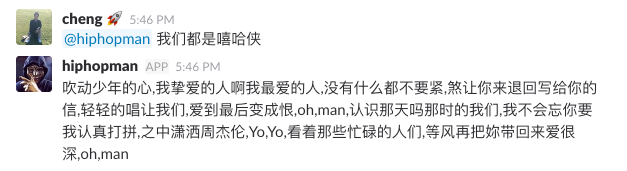

# Instroduction

freestyle bot in slack



# Usage

set up in local

```
bundle install
export SLACK_API_TOKEN= ...
rails s
```

if you want to deploy to heroku

```
heroku config:set SLACK_API_TOKEN= ...
git push heroku master
```

# Resource

- [How to create my slack bot](https://api.slack.com/bot-users)
- [slack-ruby-client](https://github.com/slack-ruby/slack-ruby-client)
- [slack-bot-on-rails](https://github.com/slack-ruby/slack-bot-on-rails)


